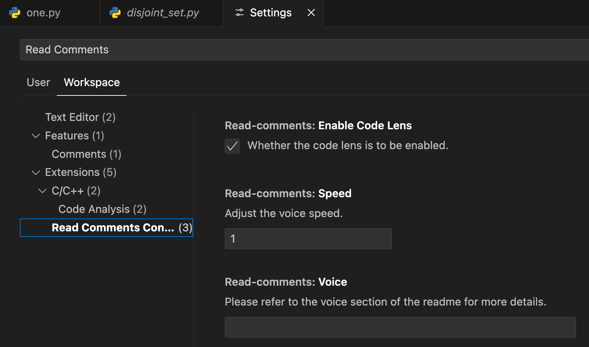

# Intro

**Read Comments** is a fun extension which reads aloud all the comments in your code,
which may not be that useful or may be it is 🤔. let me know if you find a good use case 🤣.
None the less *LORD* chatGpt 🤡 has found some of the use cases which are mentioned below 👇🏼.

## Usage Scenarios

- **Code Review**: Quickly listen to comments during a code review to catch all the important details without needing to scroll through the entire file.
- **Learning and Documentation**: Helps new developers understand the codebase by listening to the documented comments and notes.
- **Pair Programming**: Facilitates better communication between team members by reading out comments during collaborative coding sessions.


## Key Features

- **Read Aloud**: Automatically reads out all the comments in your source code, allowing you to focus on coding while staying informed about important notes and annotations.
- **Multi-Language Support**: Compatible with comments in various programming languages, making it versatile for any development environment. Currently supports python, typescript, javascript.
- **Customizable Voice Settings**: Choose from different voices and adjust the reading speed to match your preference.
- **Selective Reading**: Option to read comments from the entire file, specific sections.


## Demo

Unfortunately you can not listen to gifs but can show you how the extension looks at least.


## Requirements

**Mac OS x** :
  - None

**Linux**:
 - need to Instal [Festival](http://www.cstr.ed.ac.uk/projects/festival/)
  ```bash
  sudo apt-get install festival festvox-kallpc16k
  ```
**Windows**:
  - Needs to have Powershell installed and available in $PATH (see [issue #75](https://github.com/Marak/say.js/issues/75))

**WSL**:
  - if you are using windows linux subsystem, you have forward the audio stream to the windows kernel from your linux vm. PulseAudio does the same.
  ```bash
    sudo apt-get install pulseaudio
    sudo apt-get install pulseaudio-utils
    default-server = /mnt/c/Users/hacker/.pulse/pulse-config
  ```
  - if it still does not work try this, open the configuration file
  ```bash
  sudo nano /etc/pulse/client.conf
  ```
  and add this line 
  ```default-server = /mnt/c/Users/<your_username_here>/.pulse/pulse-config```
  

## Extension Commands
You can turn off the code lenses when not required and turn on them when required.
You can also read all the comments from command if codelens is disabled.


## Extension Settings
You can customize the speed, and enable / disable the CodeLens Feature.



Only **Mac OS X** users can customize the voice.

```bash
  say -v "?" #will give you the list of available voices.
```


## Known Issues

 1. On WSL pause does not work

## Release Notes

None

### 1.0.0

Initial release.

### Contribution
You're always welcome to contribute via providing ideas to make the package better or by adding comments parser for another language.

**Enjoy!**
